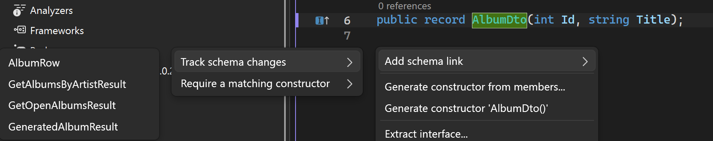

# Analyzers and code fixes

The analyzers ship with the `Rinku` package.

```csharp
/// <Schema LastUpdated="2026-08-21T14:00Z" />
public partial record GetAlbumResult(int Id, string Title);
```



## Add a schema link

```csharp
public record AlbumDto(int Id, string Title);
// Quick Action can add a schema link when the compilation contains a <Schema> declaration.
```

A type that already carries `Schema`, `BasedOn`, or `MatchConstructor` metadata is not offered another schema-link action.

## BasedOn

```csharp
/// <Schema LastUpdated="2026-08-21T14:00Z" />
public partial record GetAlbumResult(int Id, string Title);

/// <BasedOn cref="GetAlbumResult" LastUpdated="2026-08-21T14:00Z" />
public record AlbumDto(int Id, string Title);
```

When the referenced schema timestamp becomes newer, `RK0100` marks the stale link.

```csharp
/// <Schema LastUpdated="2026-08-22T09:30Z" />
public partial record GetAlbumResult(int Id, string Title, int? ReleaseYear);

/// <BasedOn cref="GetAlbumResult" LastUpdated="2026-08-21T14:00Z" />
public record AlbumDto(int Id, string Title); // RK0100
```

After reviewing the dependent type, `Acknowledge current schema` updates only the stored timestamp.

```csharp
/// <BasedOn cref="GetAlbumResult" LastUpdated="2026-08-22T09:30Z" />
public record AlbumDto(int Id, string Title, int? ReleaseYear);
```

A missing timestamp also produces `RK0100` when the referenced declaration has one.

```csharp
/// <Schema LastUpdated="2026-08-22T09:30Z" />
public partial record GetAlbumResult(int Id, string Title);

/// <BasedOn cref="GetAlbumResult" />
public record AlbumDto(int Id, string Title); // RK0100
```

Several `BasedOn` links on one type are checked independently.

## Constructor scaffold from BasedOn

```csharp
/// <Schema LastUpdated="2026-08-21T14:00Z" />
public class AlbumSchema
{
    public AlbumSchema(int id, string? title) { }
}

/// <BasedOn cref="AlbumSchema" LastUpdated="2026-08-21T14:00Z" />
public class AlbumDto
{
}
```

`Add constructor from AlbumSchema` generates the constructor shape.

```csharp
public class AlbumDto
{
    public AlbumDto(int id, string? title)
    {
    }
}
```

When generated property names are available and there is no `out` parameter, the properties action can generate members too.

```csharp
public class AlbumDto
{
    public AlbumDto(int id, string? title)
    {
        Id = id;
        Title = title;
    }

    public int Id { get; set; }
    public string? Title { get; set; }
}
```

`BasedOn` itself tracks schema review. It does not require that constructor shape.

## MatchConstructor

```csharp
public record AlbumSchema(int Id, string? Title);

/// <MatchConstructor cref="AlbumSchema" />
public record AlbumDto(int Id, string? Title);
```

Any matching instance constructor on the referenced type can satisfy the link.

```csharp
public class AlbumSchema
{
    public AlbumSchema(int id) { }
    public AlbumSchema(int id, string title) { }
}

/// <MatchConstructor cref="AlbumSchema" />
public class AlbumDto
{
    public AlbumDto(int id, string title) { }
}
```

An implicit parameterless constructor also counts.

```csharp
public class EmptySchema { }

/// <MatchConstructor cref="EmptySchema" />
public class EmptyDto { }
```

A method can provide the required parameter shape.

```csharp
public static class AlbumSchemas
{
    public static object Read(ref int id, params string?[] titles) => new();
}

/// <MatchConstructor cref="AlbumSchemas.Read" />
public class AlbumDto
{
    public AlbumDto(ref int id, params string?[] titles) { }
}
```

The match compares the following shape.

```text
parameter count
parameter order
parameter names
parameter types and reference nullability
ref out and in
params
```

Default values are not part of the match.

```csharp
public class AlbumSchema
{
    public AlbumSchema(int id = 1) { }
}

/// <MatchConstructor cref="AlbumSchema" />
public class AlbumDto
{
    public AlbumDto(int id = 2) { }
}
```

A mismatch produces `RK0101`.

```csharp
public record AlbumSchema(int Id, string Title);

/// <MatchConstructor cref="AlbumSchema" />
public record AlbumDto(string Title, int AlbumId); // RK0101
```

Several `MatchConstructor` links are all checked.

```csharp
public record IdSchema(int Id);
public record TitleSchema(string Title);

/// <MatchConstructor cref="IdSchema" />
/// <MatchConstructor cref="TitleSchema" />
public class AlbumDto
{
    public AlbumDto(int Id) { }
    public AlbumDto(string Title) { }
}
```

## Generate a missing constructor

```csharp
[AttributeUsage(AttributeTargets.Parameter)]
public sealed class SlotAttribute(string name) : Attribute
{
    public bool Required { get; set; }
}

public static class AlbumSchemas
{
    public static void Read([Slot("id", Required = true)] ref int id, params string?[] titles) { }
}

/// <MatchConstructor cref="AlbumSchemas.Read" />
public class AlbumDto
{
}
```

The generated constructor keeps the parameter contract.

```csharp
public class AlbumDto
{
    public AlbumDto([Slot("id", Required = true)] ref int id, params string?[] titles)
    {
    }
}
```

## Complete a method invocation

`RK0002` finds an uncalled method reference in a method, constructor, or local function.

```csharp
int Save(int id) => id;

int Build(int id) => Save; // RK0002
```

`Generate invocation` reuses a matching value already in scope.

```csharp
int Save(int id) => id;

int Build(int id) => Save(id);
```

Members of an in-scope value can also satisfy parameters.

```csharp
public record SaveAlbumRequest(int Id, string Title);

int Save(int id, string title) => id;

int Build(SaveAlbumRequest request) => Save(request.Id, request.Title);
```

When a value is missing, the fix can add it to the caller and pass it through.

```csharp
int Save(int id, string title) => id;

int Build(int id, string title) => Save(id, title);
```

Generated caller parameters preserve `ref`, `out`, `in`, and `params` from the called method.

Member access expressions use the same completion.

```csharp
public sealed class AlbumService
{
    public int Save(int id) => id;
}

int Build(AlbumService service, int id) => service.Save; // RK0002
```

```csharp
int Build(AlbumService service, int id) => service.Save(id);
```

Normal invocations, `nameof`, and delegate conversions are not changed.

```csharp
int Save() => 1;

void Build()
{
    Func<int> callback = Save;
    int value = Save();
    string name = nameof(Save);
}
```

When several overload candidates are available, the Quick Action can offer one invocation for each candidate.

## Schema metadata

```csharp
/// <Schema LastUpdated="2026-08-21T14:00Z" />
public partial record GetAlbumsResult(int Id, string Title);
```

Power Tools writes `Schema` metadata on generated result records. An unchanged generated record keeps its existing timestamp. A changed result shape gets a new timestamp.

Source code can expose the same schema metadata.

```csharp
public static class AlbumQueries
{
    /// <Schema LastUpdated="2026-08-21T14:00Z" />
    public static object ReadAlbum(int id, string title) => new();
}
```

The automatic schema picker searches source declarations in the current project compilation. `MatchConstructor` can be written manually against another resolvable type or method. `BasedOn` needs source `Schema` metadata for timestamp comparison.

## Severity configuration

```ini
[*.cs]
dotnet_diagnostic.RK0100.severity = warning
dotnet_diagnostic.RK0101.severity = error
dotnet_diagnostic.RK0002.severity = suggestion
```

The standard `.editorconfig` diagnostic severity settings apply.

## Diagnostic reference

| Rule | Severity | Meaning |
| --- | --- | --- |
| `RK0000` | Hidden | Offers actions for a `BasedOn` link |
| `RK0001` | Hidden | Offers to add a schema link |
| `RK0002` | Hidden | Offers to complete a method call |
| `RK0100` | Warning | A `BasedOn` link is older than its schema |
| `RK0101` | Warning | No constructor matches the referenced type or method |

## Code fix reference

| Action | Available from | Result |
| --- | --- | --- |
| `Add schema link` | `RK0001` | Adds `BasedOn` or `MatchConstructor` for a selected source schema |
| `Acknowledge current schema` | `RK0000` | Updates the stored `BasedOn` timestamp |
| `Add constructor from ...` | `RK0000` or `RK0101` | Adds the referenced parameter shape |
| `Add constructor and properties from ...` | `RK0000` or `RK0101` | Adds the constructor and assignable properties when legal |
| `Generate invocation` | `RK0002` | Invokes the selected method and threads missing parameters through the caller |

[Generated commands](generated-code.md)
