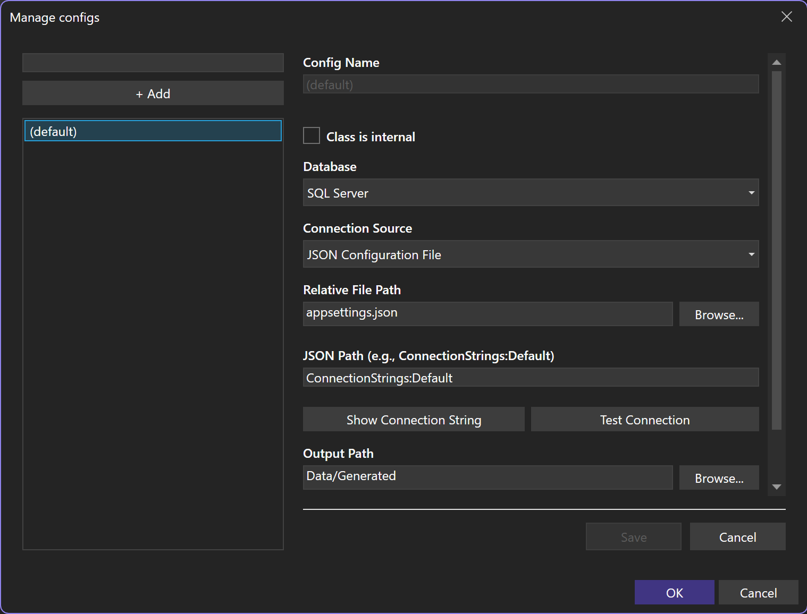

# Code generation

Rinku Power Tools reads configured database commands and generates typed `DbCommand` methods and result records.





```csharp
static readonly CachedTypeParser<List<GetAlbumsByArtistResult>> AlbumParser = new();

using SqlConnection cnn = new(connectionString);

List<GetAlbumsByArtistResult> albums = AlbumParser.Query(cnn.GetAlbumsByArtist(artistId: 7));
```

The generated method creates a normal `DbCommand`. Rinku can read it through a cached parser, or application code can execute it directly.

A query stored in `SQLFile` remains a runtime file reference in generated C# rather than embedding the SQL text.

```csharp
using DbCommand command = cnn.GetAlbumsByArtist(artistId: 7);
using DbDataReader reader = command.ExecuteReader();
```

Schema discovery supports SQL Server, PostgreSQL, and SQLite. PowerTools normally infers the provider from the resolved connection string. A configuration can set the database explicitly when a connection string is ambiguous.

The `Rinku` package also ships compile-time analyzers and code fixes; PowerTools is not required. [Analyzers and code fixes](analyzers.md) covers schema tracking, constructor contracts, and method invocation generation.

[Configure](configure.md) · [Add queries](queries.md) · [Generated commands](generated-code.md) · [Refresh](refresh.md) · [Configuration reference](configuration.md) · [Analyzers and code fixes](analyzers.md)
