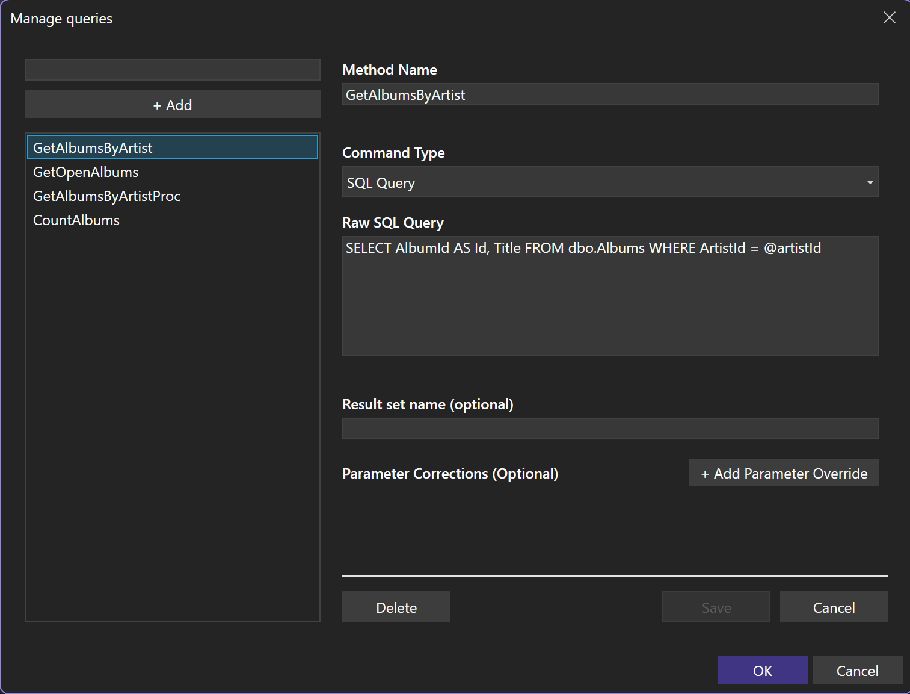
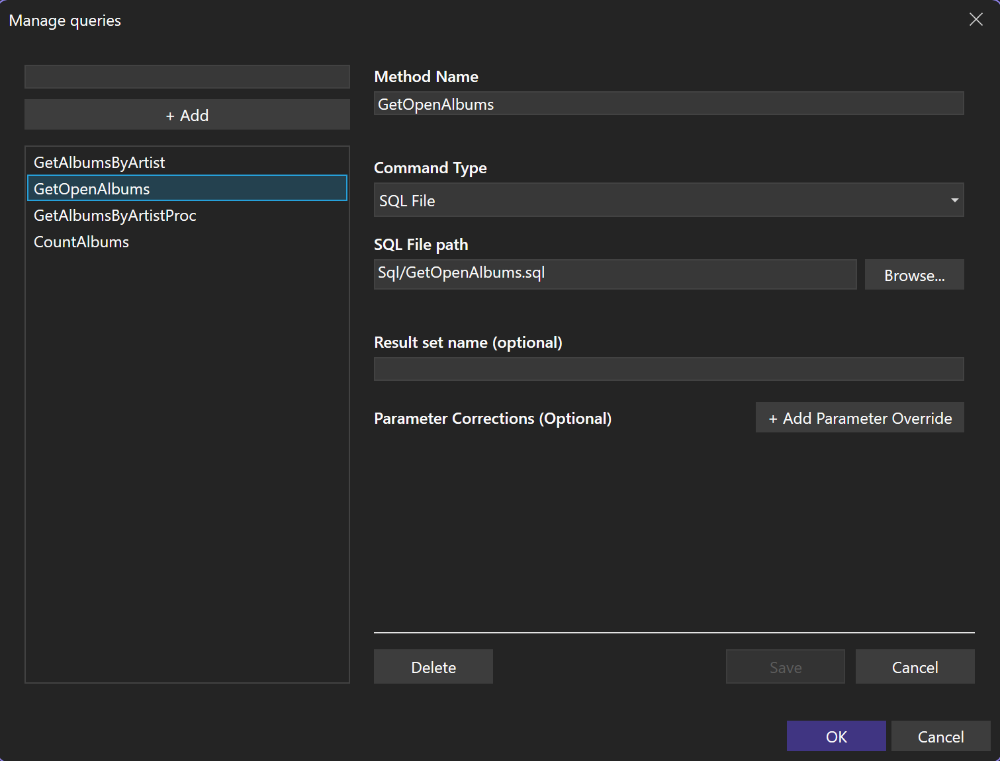

# Add queries



Each query entry produces one generated command method.

## SQL text

```text
Method Name    GetAlbumsByArtist
Command Type   SQL Query
```

```sql
SELECT AlbumId AS Id, Title FROM albums WHERE ArtistId = @artistId
```

```json
{
  "MethodName": "GetAlbumsByArtist",
  "SQLQuery": "SELECT AlbumId AS Id, Title FROM albums WHERE ArtistId = @artistId"
}
```

CodeGen inspects the command against the configured database to discover inputs and returned columns.

## Stored procedure

```text
Method Name             ArchiveInvoices
Command Type            Stored procedure
Stored Procedure Name   dbo.ArchiveInvoices
```

```json
{
  "MethodName": "ArchiveInvoices",
  "StoredProcName": "dbo.ArchiveInvoices"
}
```

SQL Server and PostgreSQL expose stored procedure entries through the configured database connection.

## SQL file



```text
Method Name    GetOpenInvoices
Command Type   SQL File
SQL File       Sql/GetOpenInvoices.sql
```

```json
{
  "MethodName": "GetOpenInvoices",
  "SQLFile": "Sql/GetOpenInvoices.sql"
}
```

A file inside the project is stored as a project relative path. A file outside the project is stored as an absolute path.

```text
C:\Projects\MyApp\Sql\GetOpenInvoices.sql
    -> Sql/GetOpenInvoices.sql

D:\SharedSql\GetOpenInvoices.sql
    -> D:\SharedSql\GetOpenInvoices.sql
```

A relative file is copied to build and publish output at the same relative path. An absolute file stays absolute and is not copied.

The generated command keeps the configured file reference.

[SQL files at runtime](generated-code.md#sql-files)

## Result name

```csharp
public partial record GetAlbumsByArtistResult(int Id, string Title);
```

A configured result set name changes that generated type name.

```text
Method Name       GetAlbumsByArtist
Result Set Name   AlbumRow
```

```csharp
public partial record AlbumRow(int Id, string Title);
```

## Parameter correction

```text
Name          @cutoff
Type          datetime2
Is Nullable   false
```

```json
{
  "MethodName": "ArchiveInvoices",
  "StoredProcName": "dbo.ArchiveInvoices",
  "Parameters": [
    {
      "Name": "@cutoff",
      "Type": "datetime2",
      "IsNullable": false
    }
  ]
}
```

A correction updates metadata for the named discovered parameter.

## PostgreSQL positional parameters

```sql
SELECT title FROM album WHERE artist_id = $1
```

The generated C# argument uses a valid name such as `p1`. The parameter is added in positional order.

[Generated PostgreSQL command](generated-code.md#postgresql-parameters)

## SQLite untyped parameter

```json
{
  "Name": "$id",
  "Type": "integer",
  "IsNullable": false
}
```

Without a correction, an unresolved SQLite query parameter stays `object?` and the provider infers its runtime type.

[Generated SQLite command](generated-code.md#sqlite-parameters)


## Remove a query

```text
Delete query
Refresh configuration
Generated method is removed
```

[Refresh generated code](refresh.md)
