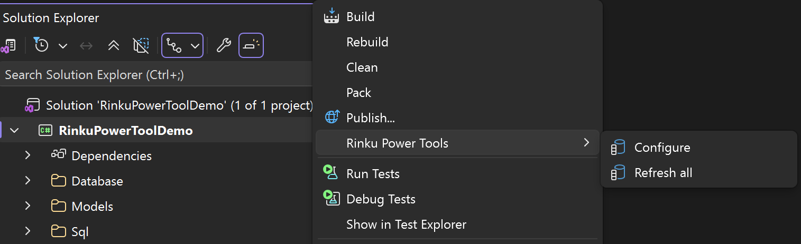
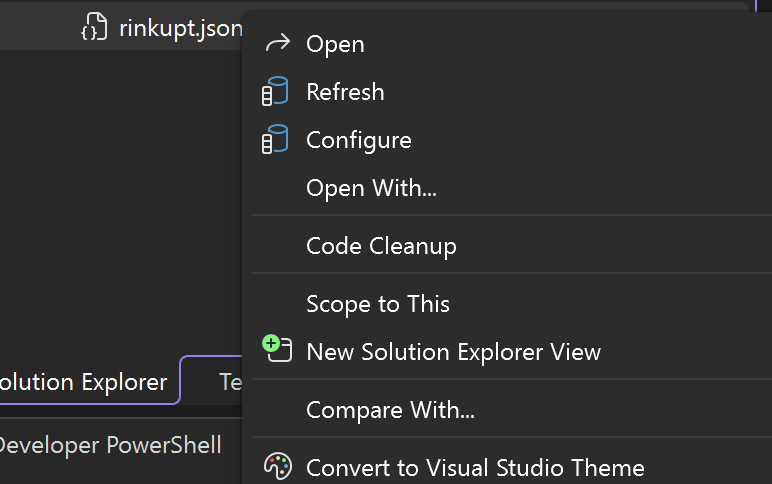

# Refresh generated code





## One configuration

```text
rinkupt.json
    Rinku Power Tools
        Refresh
```

Refreshing the selected configuration regenerates its command file and opens the generated file.

## Configure and regenerate

```text
rinkupt.json
    Rinku Power Tools
        Configure
```

The configuration manager saves the selected file and regenerates it when the changes require generation.

## All project configurations

```text
Project
    Rinku Power Tools
        Refresh all
```

Each `rinkupt` configuration is loaded and generated separately.

## Query generation failure

```csharp
#error Query generation failed for method 'GetBrokenAlbums'

// Other valid generated methods can still be emitted below this failure.
```

One failing query does not stop the other query entries from being generated.

## Result record after refresh

```csharp
public partial record GetAlbumsResult(int Id, string Title);

public partial record GetAlbumsResult
{
    public string Display => Title;
}
```

When the discovered result shape is unchanged, the generated record text is retained. When the shape changes, CodeGen regenerates that record from the discovered columns. Application members remain in the separate partial declaration.

[Generated commands](generated-code.md)
